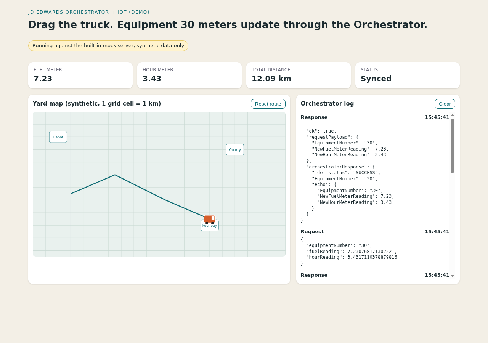

# JDE Integration Suite

Two small demos that put a JD Edwards (JDE) ERP behind modern interfaces using Orchestrator REST endpoints, plus a mock server so you can run everything without a JDE system.



## The problem

JDE holds the data that field and warehouse people need (stock by location and lot, equipment meter readings), but getting at it means JDE screens and a licence seat. Changing the ERP core to add a chat or IoT front end is slow and risky. JDE Orchestrator can publish a business function or form as a REST endpoint, so the integration can live outside the ERP. These demos show two ways to use that:

1. **IoT map demo** - drag a truck on a map; each move recomputes fuel and hour meters and posts them to the `JDE_ORCH_Sample_UpdateMeterReadings` orchestration.
2. **Stock lookup bot** - ask "LS501 in branch 550?" and get on-hand, committed, inbound and available quantities by location and lot from an item availability orchestration.

## Quick start (no JDE needed)

Python 3.9+, standard library only.

```bash
python -m unittest discover -v      # 14 tests
python -m iot_demo.server           # http://127.0.0.1:8787, uses the mock Orchestrator
python -m stock_bot "do we have LS501 in branch 550?"
```

Open `http://127.0.0.1:8787/?autodemo=1` to watch a scripted route. Sample items in the mock: `LS501`, `LS503` (branch 550), `GT41021` (branch 560). All data is invented.

Example output:

```
Item LS501 in branch/plant 550 has physical stock.
On hand: 165.00
Estimated available: 190.00  (on hand - hard - soft - outbound + inbound)
Hard committed: 20.00 | Soft committed: 10.00
Inbound: 60.00 | Outbound: 5.00 | Backordered: 12.00

Location    Lot              On hand
A-01-01     L2026-001         120.00
A-01-02     L2026-002          45.00
```

## Architecture

```
Browser (SVG map)  --->  iot_demo/server.py  --->  OrchestratorClient  --->  JDE Orchestrator (or mock)
CLI / chat adapter --->  stock_bot.handle_message
                              |-- query_parser  (text -> item, branch/plant)
                              |-- OrchestratorClient
                              `-- stock.normalize_response / format_reply
```

- `jde_suite/client.py` - one POST helper with Basic auth, the `jde-AIS-Auth-Device` header and TLS verification on by default.
- `jde_suite/stock.py` - flattens the `fs_DATABROWSE_V4101E` grid into totals per location and lot. Estimated available = on hand - hard committed - soft committed - outbound + inbound. That formula is a demo choice, not JDE's official availability calculation.
- `jde_suite/mock_jde.py` - fake Orchestrator that returns the same response shape.
- `iot_demo/` - the credentials stay server-side; the browser only calls `/api/update-meter-readings`.
- `contracts/` - trimmed OpenAPI descriptions of the two payloads this code uses (hand-written, not exported from a live system).

## Using a real JDE

Set environment variables (see `.env.example`), then run the same commands:

```bash
export JDE_BASE_URL=https://your-jde-host.example.com/jderest/v3/orchestrator
export JDE_USER=... JDE_PASSWORD=...
```

You need an orchestration named `Stock_Item_Availability` that accepts `Business Unit` and `2nd Item Number` and returns the Item Availability form, and the standard sample `JDE_ORCH_Sample_UpdateMeterReadings`. Names are configurable. Not tested against a live system since the cleanup, only against the mock.

## Limitations

- The mock matches the response shape I used, not every JDE version or form layout. Real responses may differ.
- The stock parser is regex based and handles simple English and Portuguese phrasing ("filial 550"). The original version used an LLM for parsing; that is removed here to avoid API keys.
- Telegram and WhatsApp adapters from the original project are not included. `handle_message()` is the single function an adapter would call.
- The map is a synthetic grid, not a real map provider. Fuel and hour factors are made-up constants (`jde_suite/meters.py`), and the JS copy of them must be kept in sync by hand.
- No auth on the local web server, no rate limiting, no retries. It is a demo and binds to localhost by default.
- Single equipment (`30`) and single unit of measure; no multi-user state.

## License

MIT
